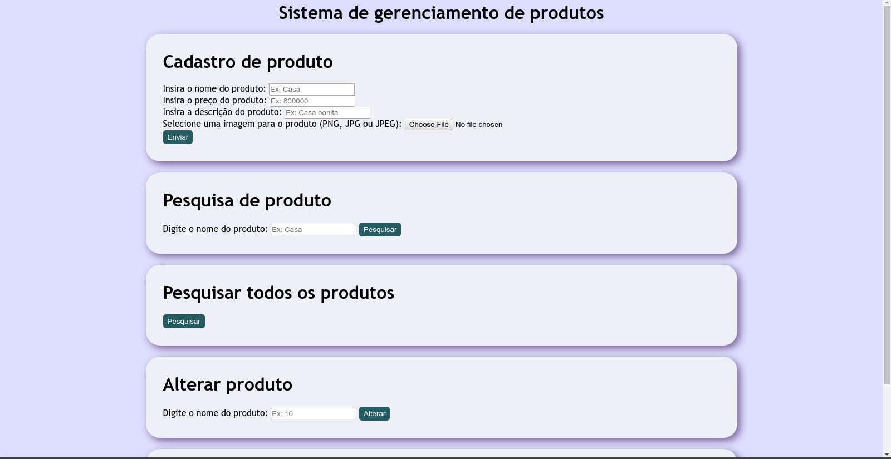

# php-mvc-CRUD
A MVC CRUD implementation with PHP

## O que é?
Um pequeno sistema CRUD desenvolvido em PHP e que obedece ao modelo MVC.

Emula em pequena escala um sistema de cadastro de produtos onde se deve cadastrar, apagar, modificar e visualizar os produtos.

Os produtos devem ter:
* Nome
* Preço
* Descrição
* Imagem

## Como instalar?
É necessário que seu sistema possua instalados os seguintes requisitos:
* Apache 2.0 (no meu caso uso a versão 2.4.38).
* PHP7 (no meu caso, 7.7.3).
* MySQL (ou compatível; no meu caso, mariadb 10.3.13).

Também é necessário configurar o Apache de forma que ele consiga interagir com o seu banco de dados MySQL (ou compatível; no meu caso, mariadb 10.3.13).

Após isso:

* Execute o script `db.sql` para criar o bando de dados que a aplicação espera que exista.
* Faça uma cópia do arquivo `config-example.php` e renomeie para `config.php`.
* Preencha o novo `config.php` com os dados para a conexão com o seu banco de dados.
* Mova todos os arquivos para a pasta que seu servidor Apache está servindo.
  * Obs.: Caso seu Apache sirva através da pasta `/srv/http/` basta executar o arquivo `copy.sh` como `sudo` que isso vai ser feito automaticamente.
* Navegue via `localhost`.

*Atenção: o servidor Apache deve ter os direitos de escrita para que o sistema funcione corretamente. Geralmente essas permissões são `755`*

## Como usar?
Após tudo configurado com sucesso, você deve ver uma tela como essa:

A partir daí, o sistema é bem auto-explicativo.

Para ver mais imagens do sistema em funcionamento clique [aqui](/assets/imgs).
